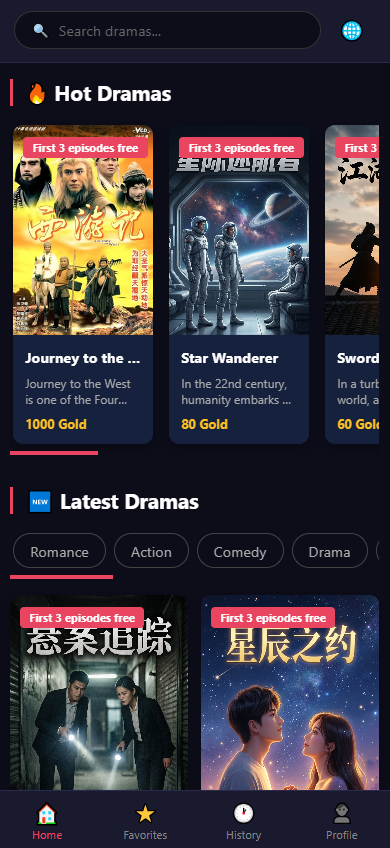
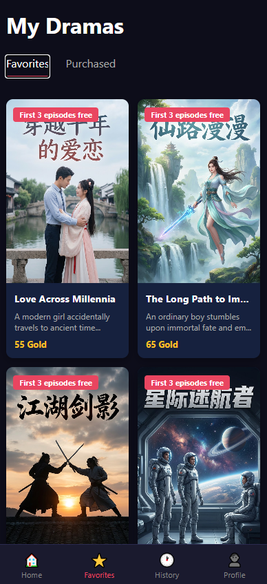
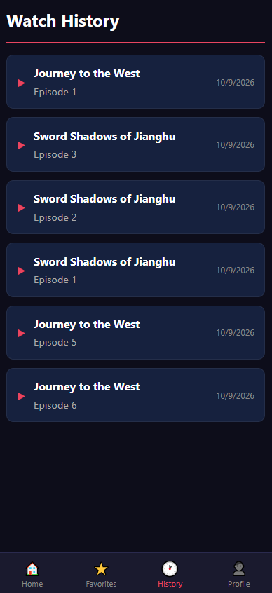
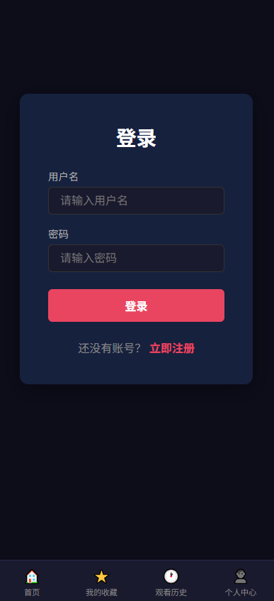
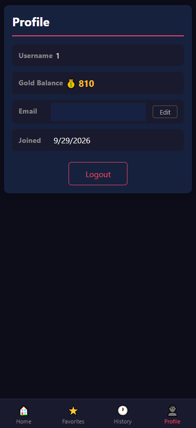

# Drama Frontend

The customer-facing web application for the Drama Platform. It lets viewers discover short dramas, watch episodes, and manage their account.

## Screenshots

| Home | Favorites |
| --- | --- |
|  |  |

| Watch history | Login | Profile |
| --- | --- | --- |
|  |  |  |

## Features

- Browse and search dramas, view drama details, and watch episodes.
- Sign in and manage favorites, watch history, and profile information.
- Responsive navigation for desktop and mobile layouts.
- English, Chinese, and Lao translations; English is the default, and a saved language preference is remembered.
- Connects to the Drama Platform API at `http://localhost:8080`.

## Tech stack

- React 19, TypeScript, and Vite
- React Router
- Axios
- Zustand
- i18next and react-i18next

## Getting started

Requirements: Node.js 20.19+ or 22.12+, npm, and a running Drama Platform backend.

```bash
npm ci
npm run dev
```

Open the local URL printed by Vite (normally `http://localhost:5173`).

## Useful commands

```bash
npm run build    # Type-check and create a production build in dist/
npm run lint     # Run ESLint
npm run preview  # Preview the production build locally
```

## Project structure

```text
src/
  api/          API clients
  components/   Shared UI components
  hooks/        Reusable React hooks
  i18n/         Translation setup and locale files
  pages/        Home, search, drama, player, and account pages
  stores/       Zustand state stores
  types/        API and domain types
  utils/        Shared utilities
```

## Related projects

- [Drama Admin](https://github.com/java858/drama-admin) — administration interface
- [Drama Backend](https://github.com/java858/drama-backend) — Spring Boot API
